# Smoke test report

_Generated 2026-06-08 23:09:00 UTC_  
_Tool: Playwright (Chromium headless)_  
_Base URL: http://127.0.0.1:8000_

**Result: 34/34 checks passed.**

## mobile-ua-redirect (9/9)

### ✅ Mobile UA hitting / lands on /m

> url='http://127.0.0.1:8000/m' title='Princess — mobile'

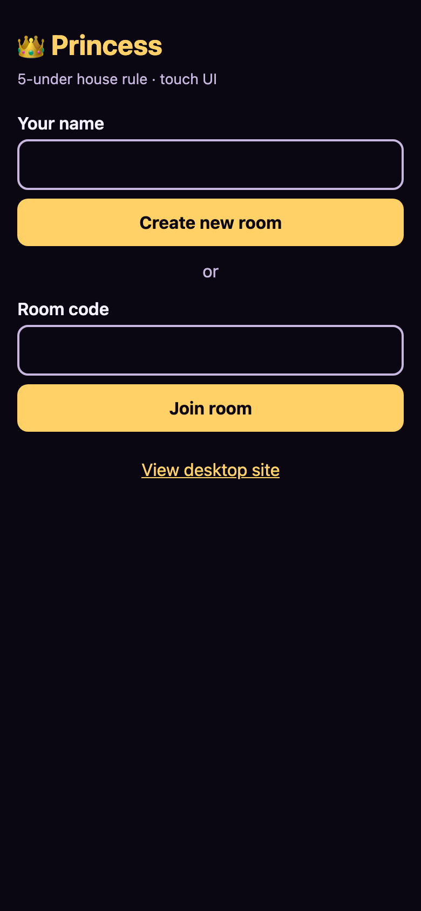

### ✅ Mobile UA hitting /room/AB12 lands on /m/AB12

> url='http://127.0.0.1:8000/m/AB12'

### ✅ Desktop UA hitting / stays on /

> url='http://127.0.0.1:8000/' title='Princess Card Game'

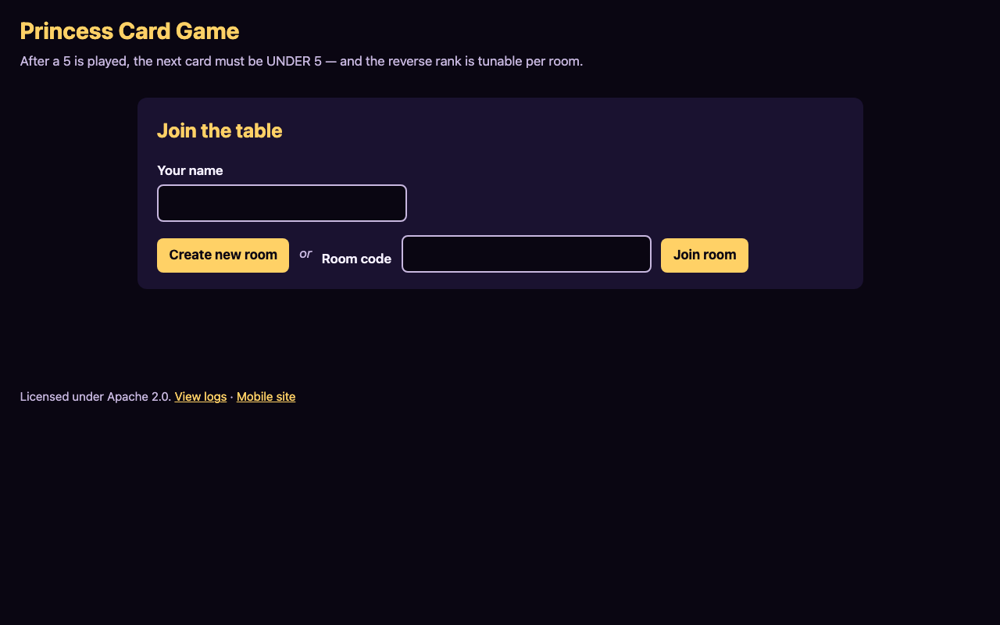

### ✅ ?desktop=1 keeps mobile UA on the desktop UI

> url='http://127.0.0.1:8000/?desktop=1' title='Princess Card Game'

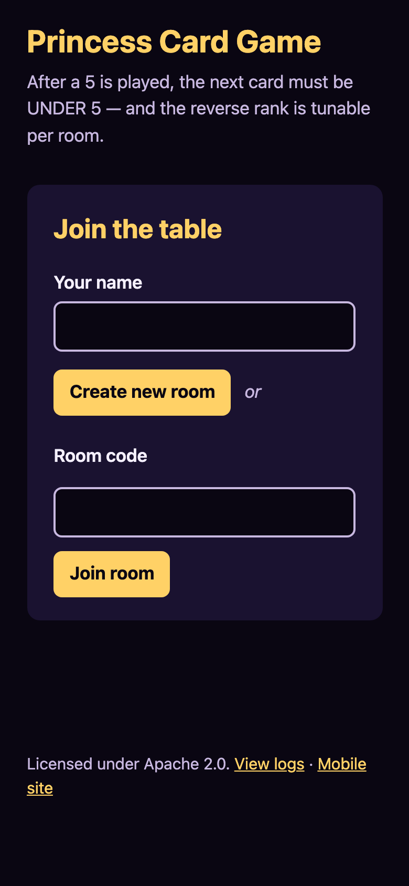

### ✅ Mobile lobby has 'View desktop site' link

> #m-switch-to-desktop visible=True

### ✅ Tapping 'View desktop site' sets cookie + lands on /

> cookie='1' url='http://127.0.0.1:8000/' title='Princess Card Game'

### ✅ Cookie keeps mobile UA on / on subsequent visits

> url='http://127.0.0.1:8000/' title='Princess Card Game'

### ✅ Desktop footer has 'Mobile site' link

> #switch-to-mobile visible=True

### ✅ Tapping 'Mobile site' clears cookie + lands on /m

> cookie_cleared=True url='http://127.0.0.1:8000/m' title='Princess — mobile' cookies={}

## deep-link-auto-join (8/8)

### ✅ Tier 3: focused view appears with no saved name

> focused_visible=True landing_hidden=True btn='Join room RJS0'

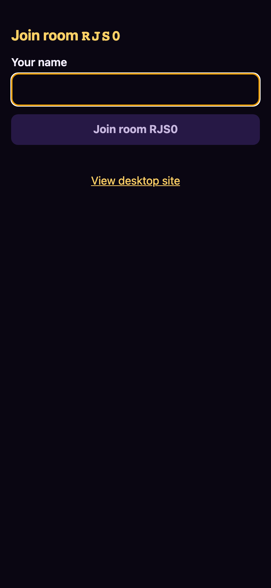

### ✅ Join button disabled on empty input

> button.disabled=True

### ✅ Whitespace-only input keeps button disabled

> button.disabled=True

### ✅ Non-empty input enables the button

> button.disabled=False

### ✅ Tier 3 submit trims and saves name; enters room

> saved_name='Pat' room_visible=True

### ✅ Tier 2: saved name auto-joins without focused view

> landed_in_room=True focused_shown=False

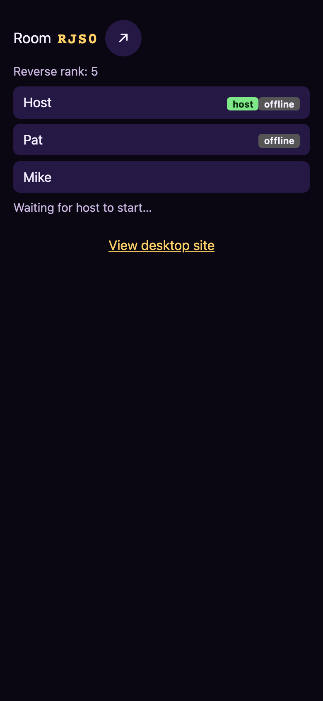

### ✅ Session sentinel persisted after join

> sentinel='{"code":"RJS0","pid":"bLbcH2Pn5-E","name":"Mike"}'

### ✅ Failure (404) falls back to landing with code prefilled + error

> landing_back=True code_input='ZZZZ' error_visible=True

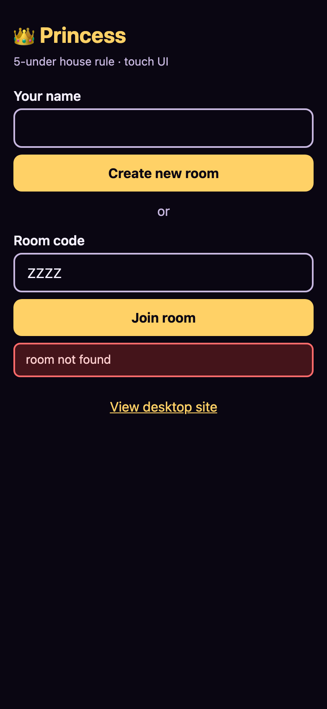

## share-room-link (7/7)

### ✅ Desktop lobby shows Share link button

> Room QJ25

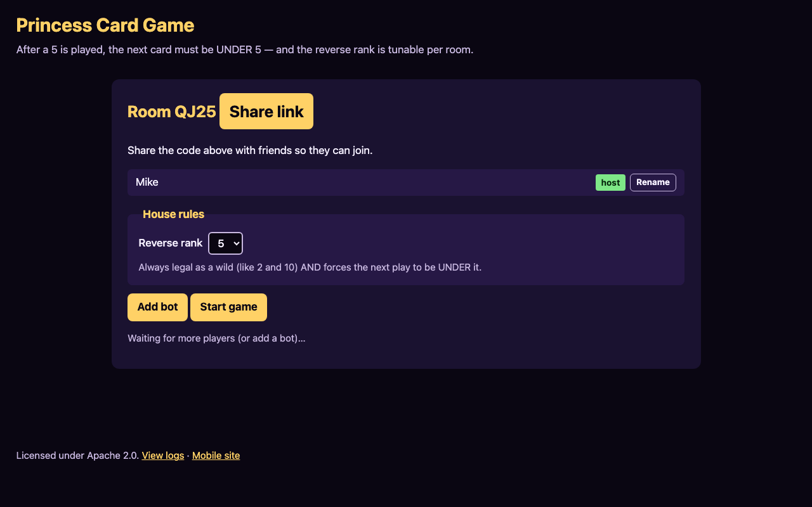

### ✅ Desktop Share button flashes 'Copied!'

> Label after click: 'Copied!'

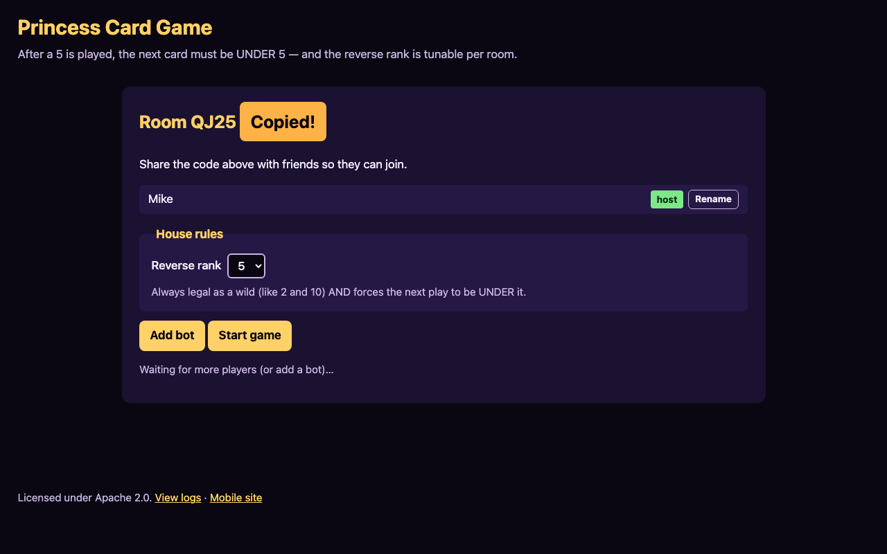

### ✅ Desktop clipboard URL matches /room/<code>

> clipboard='http://127.0.0.1:8000/room/QJ25' expected='http://127.0.0.1:8000/room/QJ25'

### ✅ Mobile lobby shows ↗ share button

> Room 26JP

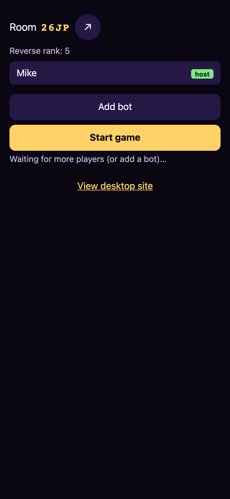

### ✅ Mobile share button glyph flashes to ✓

> button text mid-flash='✓' (expected '✓')

### ✅ Mobile share button glyph reverts after flash

> button text after flash='↗' (expected '↗')

### ✅ Mobile clipboard URL matches /m/<code>

> clipboard='http://127.0.0.1:8000/m/26JP' expected='http://127.0.0.1:8000/m/26JP'

## mobile-discard-count (4/4)

### ✅ Created mobile room

> Room O393

### ✅ Setup phase visible (Discard count won't render here, but pile-area UI not yet)

> deck='' discard=''

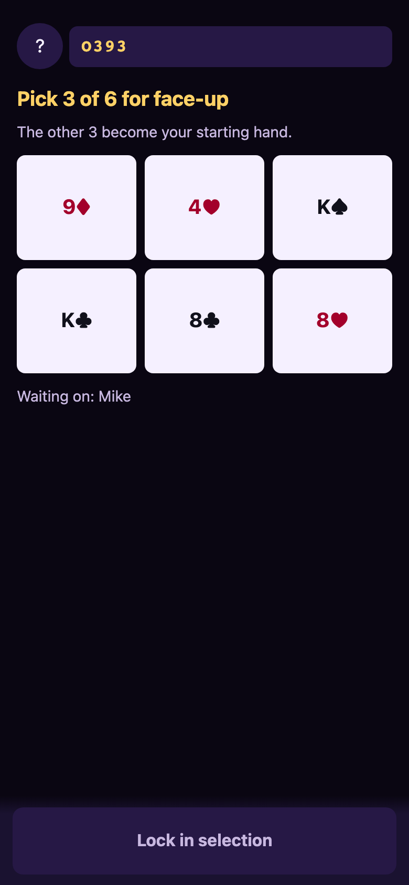

### ✅ Playing phase shows Deck and Discard stats

> deck='24' discard='1'

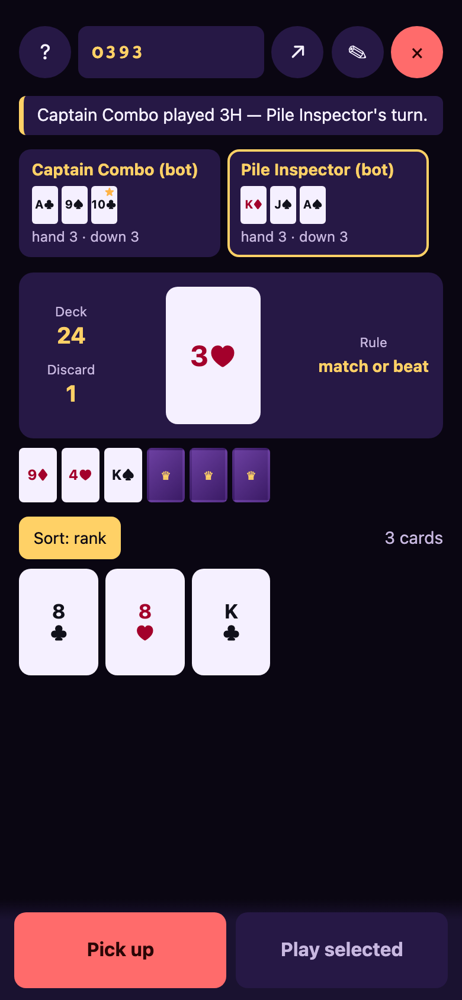

### ✅ Discard rendered below Deck in same column

> deck_y=271.234375 discard_y=320.171875

## mobile-hand-scroll-hint (4/4)

### ✅ Scroll hint chip element exists in DOM

> count=1 hidden_for_small_hand=True

### ✅ #m-game reserves bottom padding for the action bar

> computed padding-bottom=76px (need >= 50px)

### ✅ Hand sentinel attached at end of hand row

> sentinel count=1

### ✅ Chip stays hidden when the whole hand fits

> Small starting hand; nothing to overflow.

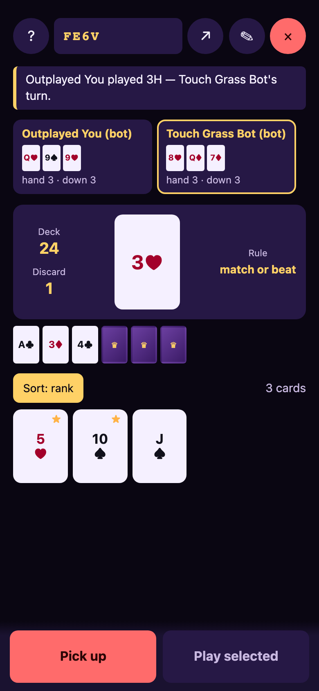

## supporting visuals (2/2)

### ✅ Opponent face-up cards rendered in chip

> m-opp-mini-card count=6

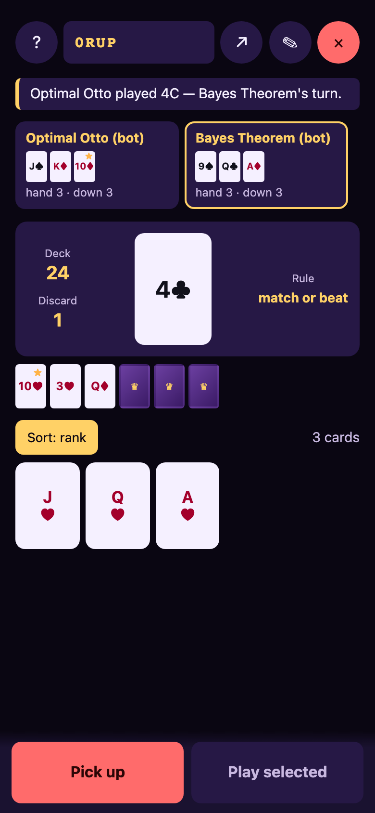

### ✅ Hand rendered as wrap row

> hand card count=3
